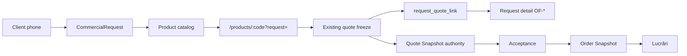

# feat: Add commercial requests

## Goal Capsule

Office staff can record a **Cerere de ofertă** (CommercialRequest) for what the client asked, find and manage it, choose a real Product, configure it with the request customer locked, freeze the existing Quote Snapshot, and reopen the request to see the linked offer. Quote, Acceptance, Order, and Lucrări stay unchanged authorities.

## Problem Frame

Quotes are findable. Incoming office requests are not representable. This is not Intake, not Product Truth, not a CRM lead, and not a second quote engine.

## Requirements

- R1. Persistent CommercialRequest: requestId, CER- reference, customerId, title, description, status, createdAt, updatedAt. No channel, people, attachments, CRM.
- R2. Statuses only: NEW / IN_REVIEW / WAITING_CUSTOMER / READY_FOR_QUOTE / BLOCKED / CANCELLED. No QUOTE_CREATED / ACCEPTED / ORDERED on the request.
- R3. ACTIVE customer required to create. Historical requests remain visible if the customer is later RETIRED. Customer may change only before the first linked quote.
- R4. No productCode on the request. Product is chosen later from the live catalog.
- R5. Separate request↔quote link table. Quote Snapshot type, payload, and contentHash stay unchanged. One quote links to at most one request. One request may link many quotes.
- R6. `/requests` registry + `/requests/:requestId` detail + `?request=` product context. Nav: Lucrări · Cereri · Oferte · Produse · Administrare.
- R7. Freeze from request context uses the request customerId and persists the link after the existing freeze. Link failure does not delete the quote.
- R8. Linked-offer stage is derived from existing Quote / Acceptance / Order projection.
- R9. Quotes without a request remain valid. Product without `?request=` remains valid. No auto-created requests.
- R10. Realign active roadmap: Cereri now, Client Workspace next. Do not start Client Workspace / People / auth / documents.

## Key Technical Decisions

1. **ID / reference.** `crq:{uuid}` like `cus:` / `per:`. Display `CER-{8 hex from uuid}` derived from requestId. No numbering subsystem.
2. **No productCode column.** Avoids a one-request-one-product dead end.
3. **Normalized mutable columns**, not snapshot payload JSON. Request is office-mutable.
4. **Link after freeze.** Optional `requestId` on existing `POST .../quote-snapshots`. Validate customer match before freeze. Persist link after persist. Recoverable `POST /api/requests/:id/quotes`.
5. **Reuse QuoteOverview items** for linked offers. Do not recompute quote stage in Request UI.
6. **Omit channel.** Legacy channel vocabulary is not a settled Final enum.

## High-Level Technical Design

## Implementation Units

### U1. Domain CommercialRequest + overview

**Goal:** Typed request truth, status contract, CER- reference, overview/detail projection, link rules.

**Files:** `packages/domain/src/requests/commercialRequest.ts`, `commercialRequest.test.ts`, `overview.ts`, `overview.test.ts`, `index.ts`, `packages/domain/src/index.ts`

**Test scenarios:** stable id/reference; ACTIVE create; retired create rejected; invalid status rejected; active-state correction; CANCELLED terminal; customer change blocked after link; linked quote stage derived; request fields never include Product Truth / EIC / price; quotes without request still project.

### U2. Persistence + API

**Goal:** Additive migration, store, runtime, `/api/requests`, optional freeze `requestId`.

**Files:** `apps/api/src/persistence/migrations/016_commercial_requests.sql`, `apps/api/src/requests/store.ts`, `routes.ts`, `apps/api/src/productSystem/runtime.ts`, `apps/api/src/app.ts`, `apps/api/src/product.ts`, `apps/api/tests/persistence.test.ts`, `apps/api/tests/requests.test.ts`

**Test scenarios:** migration count 16; create/list/read/update; retired customer cannot create; LETTERS + ACM links; accept/order derived on request; request edit does not change quote contentHash; quote without request still lists; link idempotent; customer mismatch refuses freeze.

### U3. Cereri UI + product context

**Goal:** Registry, create, detail, catalog product pick, locked customer on `?request=`, link after freeze.

**Files:** `apps/web/src/requestsApi.ts`, `RequestsOverviewPage.tsx`, `RequestDetailPage.tsx`, tests, `App.tsx`, `productApi.ts`, `ProductConfigurationPage.tsx`, `ProductConfigurationPage.test.tsx`

**Test scenarios:** human labels only; create; status update; choose product href; request context banner + locked customer; Oferte/Lucrări pages unchanged.

### U4. Runtime QA + docs

**Goal:** Playwright scenario A + negatives, screenshots, roadmap/canon/worklog.

**Files:** `e2e/helpers/requests.ts`, `e2e/requests-overview.spec.ts`, `e2e/smoke.spec.ts`, architecture/roadmap/AGENTS/worklog.

## Scope Boundaries

Out: Intake, CRM, Client Workspace, People/SK_*, auth, documents, attachments, email, channel enums, multi-product composer, Quote/Order/Execution authority changes, seed/legacy import.

## Verification Contract

Domain + API request tests; web request + product-context tests; Playwright requests + smoke + quotes/jobs regression; screenshots named in the owner GO.

## Definition of Done

Human day test all YES. Architecture verdicts in the owner GO all hold. One scoped commit after proof. Push main.
