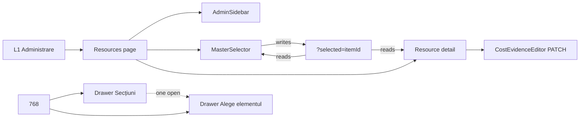

# WorkOS Architecture C UI — Wave 1 implementation plan

Mode: implementation plan. Product code for Wave 1 is implemented locally on `feat/architecture-c-ui-wave1-shell-resources-v1` and is **in review**. Owner has not accepted it.

```text
PLAN                               = WORKOS_ARCHITECTURE_C_UI_IMPLEMENTATION_WAVE_1
DATE                               = 2026-08-26
IMPLEMENTATION_BRANCH              = feat/architecture-c-ui-wave1-shell-resources-v1
IMPLEMENTATION_BASE                = e0a5e53a335334433bb6574966687b6b3c1de1a6
CURRENT_MILESTONE                  = HUB_MEDIA_CLEAN_PILOT
FIRST_HF_LOT_UI                    = OWNER_ACCEPTED
ARCHITECTURE_C_DIRECTION           = OWNER_ACCEPTED
ARCHITECTURE_C_FINAL_SIMULATION    = OWNER_ACCEPTED_WITH_ADVISORIES
ARCHITECTURE_C_UI_WAVE_1_PLANNING  = COMPLETE
ARCHITECTURE_C_UI_WAVE_1           = IMPLEMENTED_LOCAL_IN_REVIEW
OWNER_ACCEPTED                     = NO
ARCHITECTURE_C_UI_WAVE_2           = NOT_STARTED
FIGMA_LIBRARY_PUBLISHED            = NO
FIRST_REAL_LETTERS_JOB             = NOT_STARTED
HUB_SEQUENCE_NEXT_STEP             = OWNER_HUB_MEDIA_ORGANIZATION_CONFIGURATION_REVIEW
```

IdentityMenu must wrap the legal name without a fixed 59px width. SkipLink stays compact and is fully visible only on focus.

Do not treat first-HF Wave 1–5 flags as unstarted. Those lots are closed. This is a later shell and floorplan track.

---

## Summary

`/admin/resources` still stacks L1, `AdminDomainLinks` (including **Atelier — execuție**), and `OwnerCatalogView` local selection. That is the defect the accepted Architecture C simulation replaced (UX-S1-03, UX-S1-04).

Wave 1 restyles and restructures **only** that route to the accepted Architecture C floorplan: Admin L2 ≠ MasterSelector, `?selected=` as the selection authority, 768 drawers, shell Cont that stays in viewport, SkipLink only on focus, live Resources/Cost amounts.

It does not publish the Figma library, does not rewrite other admin catalogs, does not touch EIC or rates, and does not start the HUB MEDIA sequence past the already-recorded organization-configuration review.

---

## Problem frame

Owner opens Resurse and cannot tell which list is the admin domain and which is the resource. Selection dies on refresh. Compact width adds a third nav instead of one drawer. Figma Cont on the 59px accepted instance overflows; product must not ship that overflow. Figma rates are demonstration data; runtime must keep projecting live cost evidence.

---

## Sources

| Role | Path |
| --- | --- |
| Owner accept | `docs/worklog/WORKOS_ARCHITECTURE_C_FINAL_SIMULATION_ACCEPTED_WAVE_1_PLAN_V1.md` |
| Route contract | `.tmp/workos-global-ui-ux-standard-audit-v2-1a/30-worked-example-admin-resources.md` |
| Simulation (do not overwrite) | `.tmp/workos-figma-architecture-c-final-simulation-review/` |
| Correction (do not overwrite) | `.tmp/workos-figma-architecture-c-final-simulation-correction-review/` |
| Current runtime | `apps/web/src/ResourcesAdminPage.tsx`, `apps/web/src/OwnerCatalogView.tsx`, `apps/web/src/AdminDomainLinks.tsx`, `apps/web/src/AppShell.tsx` |
| First HF lot (closed) | `docs/architecture/WORKOS_FIRST_HF_LOT_IMPLEMENTATION_READINESS_CONTRACTS.md` |
| Implemented presentation | `docs/architecture/UI_UX_FOUNDATION_CANON.md` |

Figma file `Q8zfu4MZhsxLjJMGLHUHZh` page `09 — Final Simulation` is visual evidence. It is not a published library and not a rate source.

---

## Requirements

- **R1.** First implemented route is `/admin/resources`. Other routes stay on the first-HF presentation unless a later Architecture C wave names them.
- **R2.** L1 current = Administrare. Admin L2 is the real Administrare domain list from `AdminHomePage` groups. L2 must not include **Atelier — execuție**.
- **R3.** MasterSelector is a separate column from L2. Categories and resources live there. They are not one mixed nav.
- **R4.** Selection authority is `/admin/resources?selected=<stable-catalog-item-id>`. IDs stay the existing catalog prefixes: `family:…`, `recipe:…`, `missing-recipe:…`, `cost:…`. Do not mint a second identity.
- **R5.** Missing `selected` shows **Alege un element**. Invalid `selected` shows **Element inexistent**. Back, Forward, refresh, and share keep the same item.
- **R6.** 1440 / 1280: three columns — Admin L2 16rem, MasterSelector 18rem, detail. Content stays in that geometry.
- **R7.** 768: PageHeader → **Secțiuni** → **Alege elementul** → content. One drawer at a time. Escape closes it and returns focus to the trigger.
- **R8.** Desktop L1 keeps Lucrări, Atelier, Comercial, Catalog, Administrare. At 768, Catalog lives in **Meniu** overflow, not as a persistent compact L1 chip.
- **R9.** Brand text is **WorkOS Final**. Visible organization name is the live session display name. Do not render `Organizație` as a brand or placeholder company. Do not put HUB clients, people, or inventory into chrome.
- **R10.** Cont trigger is at least 44×44. The open menu stays inside the viewport, including **Ieși din cont**. Do not ship the Figma IdentityMenu overflow. Do not invent a Legal page; the product has no Legal route.
- **R11.** SkipLink remains **Sari la conținut**, hidden until focused. Do not keep a permanently visible skip row on the normal screen.
- **R12.** Amounts, units, currency, and Confirmă tarif come from live Resources/Cost. Never copy Figma `4,25 EUR/m` into product, fixtures, or expected test strings.
- **R13.** Confirmă tarif is the existing owner cost-evidence write (`CostEvidenceEditor` → `patchCostEvidence`). No new formula, no second calculator, no write on live HUB during review.
- **R14.** Operator Identifică-te is not a page CTA on this admin route (office rule: absent or passive). Atelier and execution keep the operator path.
- **R15.** Operator-facing copy stays Romanian. UI does not hardcode product fields, rates, or readiness.
- **R16.** Interactive controls that the operator must hit meet 44×44. `INTERACTIVE_TARGET_UNDER_44 = 0` on the Wave 1 route.

---

## Scope boundaries

### In

- AppShell pieces required so the accepted simulation is honest on this route: Cont, 768 Meniu overflow, SkipLink focus behavior, office-rule operator on `/admin`.
- `AdminSidebar` used first on `/admin/resources`.
- Resources master-detail, URL selection, 768 drawers, tokens for the three-column floorplan and dark canvas on this page.
- Restyle of the existing tariff editor (label and target size) without changing the PATCH contract.
- Unit, component, and e2e proof on the real backend path.

### Out

- Publishing or attaching the Figma library.
- Implementing Lucrări, Atelier, Comercial, Catalog, other admin pages, or Product System as Architecture C.
- Rewriting `OwnerCatalogView` so Utilaje, Oameni, Procese, Module, or Guvernanță change in this wave.
- EIC, commercial price, Quote, Order, inventory, or first real LETTERS job.
- HUB Cloud writes, Confirmă tarif on live HUB in audit, or synthetic rates as product truth.
- A second implementation-readiness contract file competing with `docs/architecture/WORKOS_FIRST_HF_LOT_IMPLEMENTATION_READINESS_CONTRACTS.md`.
- Reopening first-HF Wave 1–5 or visual-direction A vs C.
- New business database, seeds, or destructive data work.

### Deferred to follow-up Architecture C waves

- Apply AdminSidebar and master-detail URL to Utilaje, Oameni, Procese, Stoc, Sistem produs.
- Compact L1 overflow contents beyond Catalog.
- IdentityMenu items that have no product route yet.
- Token rename of the entire first-HF theme to Figma variable IDs.

---

## Assumptions

- V2.1a “val 2 + val 4” meant Figma library composition. This Wave 1 is the first **product** wave and includes both L2 and `?selected=` because the accepted simulation already composed them.
- Empty `selected` follows V2.1a, not a silent first-item default. The populated Figma frames are demonstration, not a default-selection GO.
- Live organization display name on HUB is the real company name already on the session. Demonstration org text **Atelier Demo** is only for synthetic / local chrome when no live org name exists. It is not a second brand.
- Dark theme already exists via `ThemeSwitcher`. Wave 1 binds this page’s canvas and elevated surfaces to those tokens; it does not import Figma `VariableID`s.

---

## Key technical decisions

1. **Do not globally rewrite `OwnerCatalogView`.** Compose Architecture C on `ResourcesAdminPage` with a new MasterSelector (and detail) that can later be reused. Other admin pages keep the Wave 4 catalog until a later wave. Rationale: Wave 1 is one route; a shared rewrite would silently restyle Utilaje and Oameni.

2. **`selected` is the catalog item id already projected by `buildResourcesCatalog`.** Category is derived from which category contains that id. Search stays local toolbar state. Rationale: V2.1a URL contract is one query param; item ids are already stable.

3. **Admin L2 destinations = `AdminHomePage` groups, minus any execution shortcut.** Keep `AdminDomainLinks` on sibling admin pages in this wave so those e2e specs do not become an undeclared restyle. Rationale: one truth for domain list; no Atelier-in-admin chrome; no forced sibling migration.

4. **Cont is a real product menu, not a Figma instance copy.** Trigger ≥44px; menu positioned to stay in viewport; actions that exist today (theme stays where it already works; logout; org switch when `memberships.length > 1`). Omit Legal. Rationale: advisory forbids shipping the 59px overflow; no Legal route exists.

5. **Implement from accepted contracts and CSS tokens, not from a published library.** Rationale: `FIGMA_LIBRARY_PUBLISHED = NO` is an Owner hold.

6. **Confirmă tarif replaces the visible Editează / Salvează pair in operator copy, same PATCH.** Existing e2e that look for **Editează** on Resurse must move with the label. Rationale: simulation and V2.1a; write path already Owner-accepted.

---

## High-level technical design



Desktop: L2 | Master | Detail.
768: header actions open one drawer; the other closes.

---

## Implementation units

### U1. Shell honesty: Cont, 768 Meniu, SkipLink, office-rule operator

**Goal:** The accepted simulation’s shell is true in product: WorkOS Final, Catalog placement, Cont in viewport, SkipLink on focus only, operator not a Resurse CTA.

**Requirements:** R8, R9, R10, R11, R14, R16

**Dependencies:** none

**Files:**
- `apps/web/src/AppShell.tsx`
- `apps/web/src/App.tsx` (nav items stay; overflow behavior is shell)
- `apps/web/src/ui/` new IdentityMenu and/or Meniu drawer only if a dedicated module is clearer than expanding `AppShell`
- `apps/web/src/index.css`
- `apps/web/src/AppShell.test.tsx`
- `apps/web/src/LoginPage.tsx` — do not rename the login **Organizație** field; that is a real form label, not brand chrome

**Approach:** Keep Level 1 items. At a compact breakpoint, persist brand + **Meniu** + Cont; put Catalog (and any L1 item that cannot keep 44px) inside the Meniu drawer using the existing `ActionDrawer` focus/Escape pattern. Replace the two-line organization chip with a Cont control whose open panel cannot paint past the viewport. On `/admin` and `/admin/*`, do not present **Identifică-te** as a primary header action; leave Atelier and execution unchanged. Do not change SkipLink copy; only prove it stays off-screen until focus.

**Patterns to follow:** `ActionDrawer` focus return; existing `.skip-link` / `:focus-visible`; `NAV_ITEMS` in `App.tsx` already labels Catalog.

**Test scenarios:**
- 1440: L1 shows Catalog; brand is WorkOS Final; SkipLink is not visible until focused; focused SkipLink reads **Sari la conținut** and moves focus to `#continut-principal`.
- 768: Catalog is absent as a persistent L1 link and present inside Meniu.
- Cont target ≥44×44; open menu including **Ieși din cont** stays within the viewport width and height.
- Visible chrome does not contain `Organizație` as a company name. Login field **Organizație** still exists on `/` unauthenticated.
- `/admin/resources` does not show Identifică-te as the page’s primary action. `/atelier` still can identify an operator.
- No HUB client or person names in header fixtures.

**Verification:** AppShell tests plus a compact-viewport e2e assertion. Visual overflow is measured, not screenshotted only.

---

### U2. AdminSidebar on Resurse only

**Goal:** Resurse has a labeled Admin L2 that is not mixed with resource selection and does not link to Atelier.

**Requirements:** R2

**Dependencies:** none (can land with or before U3; U3 consumes it)

**Files:**
- `apps/web/src/ui/AdminSidebar.tsx` (new) or equivalent under `apps/web/src/`
- `apps/web/src/ui/AdminSidebar.test.tsx` (new)
- `apps/web/src/ResourcesAdminPage.tsx` (consume; remove `AdminDomainLinks` from this page)
- `apps/web/src/AdminHomePage.tsx` (read destinations; do not invent extra admin routes)
- `apps/web/src/AdminDomainLinks.tsx` — leave in place for sibling pages

**Approach:** One list of real Administrare destinations, grouped as on `AdminHomePage` (Comercial, Operațiuni, Atelier-config, Sistem). Current item `aria-current="page"` on Resurse. No **Atelier — execuție**. Do not add empty future domains.

**Patterns to follow:** `AdminHomePage` `GROUPS` as the destination source of truth. Extract a shared destination table if duplication would create a second list; do not keep two hand-edited link sets.

**Test scenarios:**
- Resurse L2 includes Resurse, Utilaje și zone, Oameni, Procese, Stoc, Sistem produs, Date firmă, and the other live `AdminHomePage` items.
- L2 does not include **Atelier — execuție**.
- Current Resurse is announced as the current page.
- `PeopleAdminPage` / `WorkcentersAdminPage` still render `AdminDomainLinks` in this wave (characterization: siblings unchanged).

**Verification:** Component test on the destination list; Resurse page test that L2 ≠ MasterSelector.

---

### U3. Resources floorplan, `?selected=`, 768 drawers, tariff editor chrome

**Goal:** Resurse matches the accepted Architecture C master-detail contract and keeps live cost write.

**Requirements:** R1, R3, R4, R5, R6, R7, R12, R13, R15, R16

**Dependencies:** U2

**Files:**
- `apps/web/src/ResourcesAdminPage.tsx`
- `apps/web/src/resourcesCatalog.ts` (read IDs only unless a tiny helper is required)
- `apps/web/src/CostEvidenceEditor.tsx`
- `apps/web/src/OwnerCatalogView.tsx` — do not change behavior for other callers
- new MasterSelector / resources layout module under `apps/web/src/`
- `apps/web/src/ResourcesAdminPage.test.tsx` (new or extended)
- `apps/web/src/CostEvidenceEditor` tests if present; otherwise add focused tests next to the editor
- `apps/web/src/index.css` (column widths, dark canvas on this surface)
- `apps/web/src/ui/PageHeader.tsx`, `apps/web/src/ui/Notice.tsx`, `apps/web/src/ui/EmptyState.tsx`, `apps/web/src/ui/Field.tsx`, `apps/web/src/ui/StatusChip.tsx` — reuse; no business truth

**Approach:** `ResourcesAdminPage` reads and writes `selected` via the router search params. Resolve the item with `buildResourcesCatalog`. Missing → **Alege un element**. Unknown id → **Element inexistent**. Valid id → detail + optional `CostEvidenceEditor` when write is READY and the item maps to an evidence row. Search filters MasterSelector without owning selection. 768 uses two mutually exclusive drawers labeled **Secțiuni** and **Alege elementul**, reusing `ActionDrawer`. Bind page background to the existing theme canvas token so Dark is not unbound white. Rename the owner write controls to **Confirmă tarif** / keep **Renunță**. Do not change `patchCostEvidence` payload rules.

**Patterns to follow:** `CostEvidenceEditor` validation and stale-write copy; `OwnerCatalogView` empty-search copy where it still fits; Wave 4 domain-aware resources facts (no raw ids outside Detalii).

**Execution note:** Prove URL selection with a failing page test before changing local `categoryId` / `itemId` state on this route.

**Test scenarios:**
- `?selected=family:<existing family id>` shows that family’s detail after load.
- Back/Forward between two valid ids restores the matching heading.
- `?selected=nu-exista` shows **Element inexistent** and does not invent a tariff.
- `/admin/resources` with no param shows **Alege un element**, not a silent first family.
- Choosing a MasterSelector row updates the URL; refresh keeps the row.
- Filter that excludes the selected item gives honest empty/feedback without writing a fake id.
- Writable owner path still PATCHes through `patchCostEvidence`; invalid amount still shows the existing Romanian error; frozen quotes are not mentioned as live-rewritten.
- Member / non-admin still cannot write.
- Displayed amounts in tests come from the projection fixture or live admin payload, never `4,25`.
- Status chip copy stays Romanian (no English **Complete**).
- 1440: L2 column, MasterSelector column, and detail are distinct.
- 768: opening Secțiuni closes Alege elementul and the reverse; Escape returns focus to the trigger.

**Verification:** Page tests for URL and empty/invalid; editor tests for write errors; no change to EIC unit tests.

---

### U4. E2E and accessibility proof on the real path

**Goal:** PASS means browser or API evidence on the real resources admin path, including compact drawers and shell overflow.

**Requirements:** R6, R7, R8, R11, R16

**Dependencies:** U1, U2, U3

**Files:**
- `e2e/resources-admin.spec.ts`
- `e2e/admin-write.spec.ts` (Editează → Confirmă tarif on Resurse only)
- `e2e/hf-wave4-resources-admin-reuse.spec.ts` (update selectors; do not reopen Wave 4 as unstarted)
- `e2e/architecture-c-wave1-resources.spec.ts` (new) for floorplan, drawers, URL, SkipLink, Cont viewport, 768 Catalog-in-Meniu
- existing first-HF e2e that assert L1 Catalog or AppShell chrome

**Approach:** Exercise DEV or isolated Cloud owner login already used by Wave 4 resources e2e. Do not press Confirmă tarif against the recovered real HUB MEDIA Cloud root. Do not add HUB client names to traces. Measure 44px and Cont overflow in page evaluate, same spirit as the Wave 4 `measurePage` helper.

**Test scenarios:**
- Covers V2.1a QA: 1440 light/dark L2 ≠ Master; 768 Meniu; one drawer; Escape; valid/invalid/missing `selected`; filter honesty; operator not a page CTA.
- Existing resources inspect path still shows live family/spec/cost from the backend (example: current spec already expects plexiglas evidence from the plane, not Figma numbers).
- Sibling admin e2e (Oameni, Utilaje) still pass with `AdminDomainLinks`.
- SkipLink hidden until Tab focus.

**Verification:** Playwright on the real admin projection. Screenshots are evidence, not PASS by themselves.

---

## Risks

| Risk | Treatment |
| --- | --- |
| Global AppShell change regresses Atelier / Comercial | Keep operator primary path on Atelier; limit office-rule passivity to `/admin`. Run existing shell and Wave 3 e2e. |
| Shared `OwnerCatalogView` rewrite leaks into other catalogs | Do not change its selection model in this wave. |
| Two admin destination lists | Extract one table from `AdminHomePage` if L2 is implemented. |
| Label Confirmă tarif breaks write e2e | Update Resurse specs in the same unit as the label change. |
| Implementer copies Figma 4,25 | Explicit test ban; review rejects any new expected string containing that amount. |
| Unpublished library temptation | Plan forbids publish and Code Connect as a Wave 1 dependency. |

---

## System-wide impact

Operators on Resurse get a clearer domain vs resource split and shareable selection. Sibling admin pages stay Wave 4. Shell Cont and 768 Meniu are visible on every route — that is intentional and must stay within viewport and 44px rules everywhere the new Cont renders.

Resources/Cost remains the owner of amounts. UI remains a projection.

HUB MEDIA sequence is unchanged: next named Cloud step stays `OWNER_HUB_MEDIA_ORGANIZATION_CONFIGURATION_REVIEW`. This plan is not that review and not steps 9–10.

---

## Documentation on a later implementation GO

When implementation is authorized, update `docs/architecture/UI_UX_FOUNDATION_CANON.md` to describe the **implemented** Architecture C Resurse floorplan (runtime wins). Do not write that as current law in this planning GO.

Do not create `docs/architecture/WORKOS_ARCHITECTURE_C_IMPLEMENTATION_READINESS_CONTRACTS.md`. This plan plus the V2.1a worked example plus the Owner accept worklog are enough.

---

## Definition of done (for the future implementation GO only)

- R1–R16 hold on `/admin/resources` with runtime evidence.
- Figma library still unpublished unless a later Owner GO says otherwise.
- No EIC, commercial, or HUB write side effects.
- First HF lot flags remain `OWNER_ACCEPTED`.
- `ARCHITECTURE_C_UI_WAVE_1_IMPLEMENTATION` flips only after Owner review of that implementation.

Implementation GO landed. Local review state:

```text
ARCHITECTURE_C_UI_WAVE_1 = IMPLEMENTED_LOCAL_IN_REVIEW
OWNER_ACCEPTED           = NO
ARCHITECTURE_C_UI_WAVE_2 = NOT_STARTED
```
