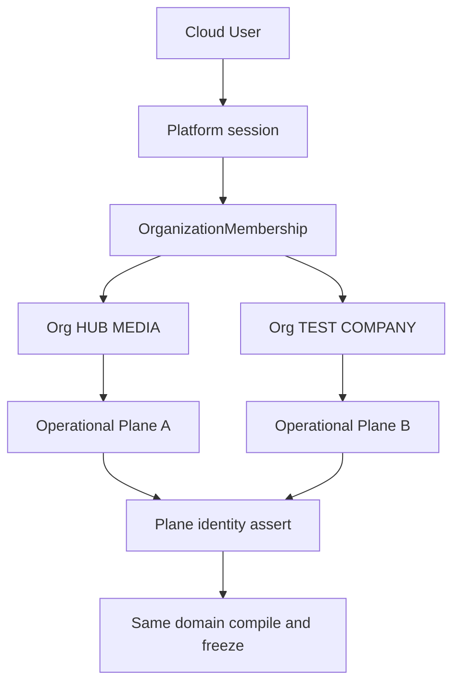
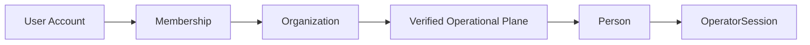

# WorkOS Cloud — Organization Readiness Master Audit V1

Status: **PASS_FOR_CLOUD_FOUNDATION_PLAN**
Mode: architecture / readiness audit. **No Cloud implementation.**
Baseline: `office952/workos-final` `main` @ `8b3ac3566b517b29622120a31790bf0b27d83b57`
Branch: `docs/audit/workos-cloud-organization-readiness-v1`
Date: 2026-08-18

Owner confirmation: accepted core direction **with mandatory amendments**. This document is the amended canonical audit. It does not authorize Foundation implementation.

```text
RESOURCE COST EVIDENCE ADMIN WRITE V1 = DONE / BASIC / IN MAIN
CLOUD IMPLEMENTATION AUTHORIZED = NO
SQLITE_PER_ORG_IS_PERMANENT_ARCHITECTURE = NO
OPERATIONAL_PLANE_IDENTITY_GUARD_REQUIRED = YES
SECOND_ORG_PROVIDER_ISOLATION_REQUIRED = YES
HUB_MEDIA_CANONICAL_DATASET_OWNER_SELECTION_REQUIRED = YES
ORG_OWNED_CATALOG_EXTENSION_SEAM_RESERVED = YES
INITIAL_HUB_MEDIA_CLOUD_OWNER = OWNER_SELECTED / TO_BE_CONFIRMED_AT_FOUNDATION_IMPLEMENTATION
```

---

## A. Verdict

**PASS_FOR_CLOUD_FOUNDATION_PLAN**

The smallest correct transition from today's single-company WorkOS to WorkOS Cloud is:

- one WorkOS product / one platform
- many Organizations
- a small shared **Control Plane**
- an organization-isolated **Operational Plane**
- HUB MEDIA as Organization #1 by **explicit canonical-dataset adoption**, not by grabbing the current worktree file
- TEST COMPANY as Organization #2 to prove isolation, including provider/workcenter/machine projection

A PASS here does **not** authorize implementation. Next build, after a separate Owner GO:

`WORKOS_CLOUD_FOUNDATION_V1`

WorkOS Cloud is not WorkOS Hub. Hub remains later and must exchange explicit contracts / handoff snapshots, never private operational tables.

---

## B. Repository / HEAD / runtime truth

- Canonical branch: `main` @ `8b3ac3566b517b29622120a31790bf0b27d83b57`
- Persistence: 22 committed migrations, 24 SQLite tables, `better-sqlite3`, WAL, paths via `WORKOS_DATA_DIR` / `WORKOS_SQLITE_PATH` in `apps/api/src/persistence/sqlite.ts`
- `createProductSystemRuntime(sqlitePath, { documentsRoot })` already binds one process to **one** SQLite file and **one** documents root. All stores operate inside that runtime. This is the existing structural seam the Operational Plane should reuse.
- Domain compile / freeze is DB-agnostic: `lookupCostEvidence(rows)`, `compileEic(..., evidenceRows)`, Quote / Order / Release freeze
- Runtime is single-company: one seller singleton, one active Cost Evidence set, one people registry, one workcenter/machine code catalog, unfiltered list APIs
- `apps/api/src/app.ts` registers routes after CORS. There is **no** global authentication or organization-membership barrier
- OperatorSession (PIN / DEV) gates only task start / complete. Remaining write APIs, including Cereri upload/download, are reachable without a Cloud principal
- Authorization enforcement is documented `NOT_IMPLEMENTED` in `docs/architecture/PRODUCT_SYSTEM_PERSISTENCE_CANON.md`
- No `organization_id` / tenant column exists in product schema. That remains correct for the recommended Foundation model.

---

## C. Current single-company assumptions

These are safe only because there is one workshop:

- Global unique active Cost Evidence per `resource_id` / `(resource_id, volume_depth_mm)` — `apps/api/src/persistence/migrations/022_resource_cost_evidence.sql`
- Global bootstrap markers `RESOURCE_COST_EVIDENCE_V1_APPLIED` and `PEOPLE_TRUSTED_WORKFORCE_V1_APPLIED`
- Trusted workforce seeds real HUB MEDIA people (`per:legacy:*`) into every non-test database at startup
- Seller lazy-seeds `seller:current` as **HUB MEDIA PRODUCTION S.R.L.** — `packages/domain/src/seller/identity.ts`
- Workcenters and machines are a **code catalog of this shop floor**, not an organization-scoped projection. `GET /api/workcenters` always uses the module singleton `workcenterRegistry` (`MCH-CNC-4020`, assembly tables, Epson, laser, etc.)
- Content-hash snapshot IDs and UNIQUE `content_hash` are unique inside one operational dataset
- All list/get APIs return the entire bound database
- Display-label PK is `(entity_kind, entity_id)`
- `skills.code` UNIQUE is dataset-global
- Documents live under one `{WORKOS_DATA_DIR}/documents/` tree
- Multiple worktrees / DEV / QA SQLite files exist. None of them is automatically the HUB MEDIA pilot dataset

---

## D. Cloud destination model

```text
WORKOS CLOUD (platform)     ≠     WORKOS HUB (later network)
        |                              |
   many Organizations                  explicit CapabilityOffer /
   each with own Operational Plane     frozen handoff contracts
                                       never private-table reads
```

- One product, many organizations. Not one fork per company.
- HUB MEDIA = first real pilot organization.
- TEST COMPANY = synthetic isolation proof, not a demo decoration.
- A dedicated enterprise deploy later must be the **same product**, one isolated Operational Plane on isolated infrastructure.

---

## E. Tenancy data model comparison

### A. Shared database + `organization_id` on every operational row

- Isolation depends on every query remembering a filter. Today's stores are unfiltered full-table scans. IDOR risk is high.
- Almost every UNIQUE must become `(org_id, …)` — Cost Evidence partial indexes, seller singleton, `skills.code`, request reference, content hashes.
- Content-addressed `qts:` / `ord:` / `aps:` IDs collide if two organizations freeze identical hashed content unless `orgId` is forced into the hash.
- Bootstrap markers stay process-global unless redesigned.
- Appropriate only if near-term cross-organization SQL analytics are required. They are not.

### B. Database / schema per organization, no Control Plane

- Isolation is physical. Today's operational schema and uniques can stay.
- Bootstraps become per-plane naturally.
- Cannot express “one User in two Organizations”.
- Cannot switch context.
- Path-only binding without a plane identity guard is the dangerous form of this model.

### C. Hybrid: shared Control Plane + organization-isolated Operational Plane — recommended

- Control Plane: Organization, User, Membership, platform session, active organization context.
- Operational Plane: today's operational schema and document root, **one bound dataset per Organization**.
- No `organization_id` sprayed across customers, quotes, people, Cost Evidence, inventory, execution.
- Organization boundary = which verified Operational Plane the request is bound to.
- Foundation / local pilot may implement that plane as one SQLite dataset + data dir per Organization, because that matches `ProductSystemRuntime` today.
- Later hosted persistence may use a Postgres database, schema, shard, or dedicated infrastructure **without changing the domain or the Organization → Operational Plane law**.
- Dedicated enterprise = one Operational Plane on isolated infrastructure.

---

## F. Recommended tenancy model

**TENANCY_DATA_MODEL = hybrid (C)**
**STABLE ABSTRACTION = Operational Plane**
**FOUNDATION IMPLEMENTATION = SQLite operational dataset per Organization**
**SQLITE_PER_ORG_IS_PERMANENT_ARCHITECTURE = NO**



Binding law for Foundation V1:

1. Authenticate the Cloud principal.
2. Resolve `activeOrganizationId` from membership. This must not come from a trusted arbitrary client header.
3. Resolve the Organization's Operational Plane location from the Control Plane.
4. Open the plane.
5. **Assert** the plane's own immutable identity belongs to that Organization.
6. Only then construct / serve `ProductSystemRuntime`.

The Control Plane must not be the only record that says “Organization A → path A”. A misrouted path to Organization A's dataset while serving Organization B is the most dangerous failure of database-per-org. The plane itself must be able to say “I belong to organization X”.

This is **not** `organization_id` on every operational table. It is one minimal immutable `OperationalPlaneIdentity` (singleton / manifest / equivalent) inside the plane.

---

## G. Truth classification matrix

Do **not** classify every current TypeScript catalog as `PLATFORM_GLOBAL` forever.

### Layer A — PLATFORM KERNEL / VOCABULARY

Stable platform meaning. Changing it is a product-contract change, not a company setting.

Examples: component-role semantics; unit vocabulary; snapshot / freeze law; compiler contracts; generic EIC / recipe machinery; CapabilityClass vocabulary where genuinely generic; User / Person / Organization identity law.

### Layer B — PLATFORM CURATED DEFINITIONS

WorkOS-supplied canonical definitions. Code-owned today. Not editable by companies as source. May later be versioned/activated.

Examples: current LETTERS and ACM ProductTemplates; current ResourceDefinitions; current recipes; current operational process catalog; current HUB MEDIA workcenter/machine **definitions** as a curated HUB MEDIA registry, not as the only possible registry.

### Layer C — ORGANIZATION CONFIGURATION / ACTIVATION

Organization-specific active truth. Some of this already exists as writes; all of it becomes plane-owned.

Examples: active Cost Evidence amounts; display labels; seller / Date firmă; which curated products / resources / processes are active for this company; organization technical-setting values (later); commercial policy (later); provider/workcenter/machine **projection** for this company.

### Layer D — ORGANIZATION-OWNED EXTENSIONS — later, reserved

A future company may need its own Product Template, resource/material, process, recipe, or equipment/provider definition **without forking WorkOS**. Foundation does not implement this. The architecture must not close the gate.

`ORG_OWNED_CATALOG_EXTENSION_SEAM_RESERVED = YES`

### Cross-cutting owners

- **USER_OWNED:** Cloud User/Account, credentials, multi-organization membership list
- **ORGANIZATION_OWNED:** Control-plane membership plus everything in the Operational Plane (customers, people, inventory, documents, execution, Cost Evidence amounts, seller, requests, quotes, orders, provider projection)
- **TRANSACTION_FROZEN:** Quote / Acceptance / Order / Production Release; frozen customer `{id, displayName}`; frozen seller legal fields; frozen EIC rates; used recipes / used settings
- **HUB_SHARED_FUTURE:** explicit CapabilityOffer, cross-organization work request, frozen handoff snapshot, delivery status. Never salary, Pontaj, internal cost, margins, private customers, or private suppliers

Two-layer examples:

- Capability **class** = Layer A. Capability **availability / machine that provides it** = Layer C now, Layer D later for company-created equipment.
- Resource **identity** of plexiglas_3mm_opal = Layer B today. Active rate = Layer C. Snapshot rate = TRANSACTION_FROZEN. A company-created specialty film = Layer D later.
- LETTERS formula = Layer B. A company must not edit the canonical LETTERS formula in Foundation. That does not mean every future company is permanently limited to HUB MEDIA's catalog.

---

## H. Table / persistence ownership matrix

Do **not** add `organization_id` to operational tables under the recommended Foundation model. Ownership is the verified Operational Plane.

**Stay in the Operational Plane (per Organization; schema preserved where possible):**

- `customers`, `commercial_requests`, `commercial_request_quote_links`, `commercial_request_attachments`
- `quote_snapshots`, `quote_acceptance_decisions`, `order_snapshots`, `accepted_production_snapshots`
- `execution_plans`, `execution_tasks`, `execution_task_dependencies`, `execution_task_actual_consumption`
- `inventory_movements`
- `people`, `skills`, `person_skill_assignments`, `capability_skill_requirements`, `operator_credentials`, `operator_sessions`
- `resource_cost_evidence`
- `seller_profile`
- `product_system_display_metadata`
- `runtime_bootstrap_markers`
- document bytes under that plane's documents root
- future `OperationalPlaneIdentity` singleton / manifest (Foundation safety; not designed as a row on every table)

**New, shared Control Plane only:**

- `organizations`
- `users` / accounts
- `organization_memberships`
- platform session, distinct from OperatorSession
- pointer from Organization → Operational Plane location (path / schema / DSN later)

**Code catalogs, not operational tables today:** ProductTemplates, resources, recipes, processes. Workcenters/machines remain code-owned curated definitions, but Foundation must project them **per Organization** so TEST COMPANY cannot see HUB MEDIA equipment.

Derived ownership (acceptance → quote → order → release → plan) is safe **inside one plane**. Isolation of the plane makes derivation sufficient.

---

## I. ID / uniqueness / sequence audit

- UUID-style IDs (`cus:`, `crq:`, `att:`, `cev:`, `ops:`) are unique enough. Per-plane uniqueness makes collision irrelevant.
- Human refs: `CER-{8 hex}`, `OF-{hash8}` may repeat across Organizations. That is acceptable if scoped by Organization.
- Content-hash IDs (`qts:`, `ord:`, `aps:`) are unique **per plane**. Two Organizations may freeze identical commercial content and get the same technical ID in different planes. That is acceptable. Do **not** rewrite existing HUB MEDIA hashes to inject organization identity.
- Future Hub handoffs should carry frozen seller + organization identity as attribution, not by changing historical IDs.
- Legacy people/skill IDs (`per:legacy:*`, `skl:legacy:*`) must be present **only** in the HUB MEDIA plane.
- `seller:current` stays a per-plane singleton.
- Plane identity is a separate immutable fact. It does not participate in quote content hashes.

---

## J. Bootstrap marker audit

| Marker / seed | Safe for one company? | Multi-organization problem | Smallest future model |
|---|---|---|---|
| `RESOURCE_COST_EVIDENCE_V1_APPLIED` | Yes | A process-global marker would skip Organization B seed. A shared table cannot hold two Plexi rates. | Marker stays **per Operational Plane**. Each new Organization copies platform seed amounts once, then owns them. |
| `PEOPLE_TRUSTED_WORKFORCE_V1_APPLIED` | Yes | Would skip Organization B **or** insert real HUB MEDIA people into Organization B. | Marker per plane. **HUB MEDIA keeps current people.** New Organizations must **not** copy `trustedWorkforce.ts` names. Synthetic or empty workforce. |
| Seller `ownerConfirmedSellerProfile` | Yes | Organization B would legally become HUB MEDIA PRODUCTION S.R.L. | Per-plane seller. TEST COMPANY needs a synthetic Date firmă. |
| Display-label `INSERT OR IGNORE` | Mostly | Shared table = one label wins. | Per-plane labels; same platform defaults are fine. |
| Capability↔skill `INSERT OR IGNORE` | Mostly | Shop-floor skill map is HUB MEDIA operational truth. | Per-plane copy of a platform default map is acceptable for V1. |
| `workcenterRegistry` module singleton | No, once two Organizations exist | TEST COMPANY would inspect CNC 4020, assembly tables, Epson, laser — real HUB MEDIA equipment. | Organization-scoped provider projection. Not full Machine Admin. See section Q. |

---

## K. User / Person / Operator access model



Preserve without contradiction:

- **User** = WorkOS Cloud account / platform principal. Not an employee.
- **OrganizationMembership** = that User's right to enter an Organization.
- **Person** = operational employee/person **inside one Organization**.
- **OperatorSession** = workshop identity via PIN / DEV, over an **already selected and authenticated Organization context**.
- A Person **may exist without a User account**.
- A Person without a Cloud User does **not** receive anonymous access to protected Cloud APIs.

Access law:

1. Protected `/api/*` requires an authenticated Cloud session that already belongs to the active Organization (User membership, or a later Owner-chosen equivalent organization/device session for the pilot).
2. OperatorSession then identifies the shop-floor Person on that Organization context.
3. Claim-on-start / complete continue to require OperatorSession bound to a Person in that plane.
4. DEV Operator Mode remains local-only and fail-closed in production. It is not Cloud login.

Do not implement a device-account architecture in this audit. Foundation implementation must choose the smallest practical pilot flow that still satisfies: **no anonymous protected Cloud API**, and **PIN is not a substitute for Organization authentication**.

No User/Account exists today. “Owner” is a UX concept, not a principal.

**INITIAL_HUB_MEDIA_CLOUD_OWNER** = `OWNER_SELECTED / TO_BE_CONFIRMED_AT_FOUNDATION_IMPLEMENTATION`

The first pilot needs at least one HUB MEDIA Organization `owner` membership. Actual name / email / credential is an Owner decision at implementation time. This document does **not** canonize any personal identity.

---

## L. Organization profile / seller model

Keep **three** identities. Do not merge.

1. **Organization** — workspace name / slug for Cloud context and switcher
2. **Seller / Date firmă** — legal commercial identity (`seller_profile`), already frozen into quotes
3. **Brand / display** — seller.brand / Organization display; cosmetic

HUB MEDIA PRODUCTION S.R.L. is the live seller seed in the current single-company dataset. After adoption, Organization #1 display name is HUB MEDIA; the seller row stays as adopted. Renaming the Organization later must **not** rewrite frozen quote seller fields (same law as live customer rename today).

TEST COMPANY must have a different seller / company identity.

---

## M. Product System organization boundary

- Compiler, roles, snapshot law, form-contract machinery = Layer A
- Current LETTERS / ACM templates and constructive types = Layer B, code-owned today
- Display labels = Layer C, already persisted, become per-plane
- Technical setting **values** (`ledPitchMm`, etc.) are still code — future Layer C + TRANSACTION_FROZEN via `usedTechnicalSettings`. Not Foundation V1
- Organization catalog activation (which curated products are offered) = Layer C, later unless Foundation needs it for isolation
- Organization-created Product Templates = Layer D, reserved, not Foundation
- Do not let 100 companies edit the canonical LETTERS formula
- Do not design Cloud so every company is permanently limited to HUB MEDIA's code catalog

---

## N. Resource / Cost organization boundary

Accepted Cost Evidence architecture stays:

- Resource identity of the current catalog = Layer B
- Active Cost Evidence = SQLite in the Organization's Operational Plane (Layer C)
- History = superseded rows in that plane
- Snapshot rates = TRANSACTION_FROZEN

Organization A Plexi 18 and Organization B Plexi 22 = two planes, same `lookupCostEvidence(rows)` injection already used by `apps/api/src/product.ts`. No Cost Evidence redesign. Do not add `organization_id` to `resource_cost_evidence`.

Admin still cannot create new qualified aluminium depths. Creating new resources is Layer D, later.

---

## O. Commercial organization boundary

- Customer, request, quote, acceptance, order, PDF, attachments = Operational Plane
- Commercial policy (35% / 21% / EUR) is **code** today (`packages/domain/src/commercial/policy.ts`). Future Layer C. Not Foundation V1 — frozen numbers already protect history
- Quote freeze already copies customer + seller. Live rename does not rewrite history
- Numbering stays content-hash / UUID-derived

---

## P. People / HR future boundary

- People, skills, assignments, availability, PIN = Operational Plane
- Salary, Pontaj, leave, payroll stay out. Pontaj ≠ Execution. Employee salary ≠ Cost Evidence
- Capability↔skill default map may copy per plane
- A Person without a User is valid workforce truth. It is not an API login.

---

## Q. Machines / workcenters boundary

**SECOND_ORG_PROVIDER_ISOLATION_REQUIRED = YES**

Today the catalog in `packages/domain/src/workcenters/catalog.ts` is a real HUB MEDIA shop map: `WC_ASSEMBLY_01`, `WC_CNC_ROUTING`, `MCH-CNC-4020`, `MCH-EPSON-60800`, `MCH-LASER-CNC`, welding sets, laminators, plotter, styro cutter. `GET /api/workcenters` always projects `workcenterRegistry`. Execution eligibility uses the same singleton.

The previous draft called TEST COMPANY seeing that catalog an allowed P2 gap. **That is rejected.** If Organization B can inspect HUB MEDIA machines, workcenters, equipment identities, or shop-floor arrangement, Cloud isolation is not proven.

Foundation still does **not** need complete Machine Admin, capacity, or equipment CRUD.

Smallest legitimate seam, consistent with the repo:

- Domain functions already accept `WorkcenterRegistry` (`projectWorkcentersAdministration`, `providersForCapability`, coverage, where-used). The module singleton is only the current default.
- Treat the current arrays as the **HUB MEDIA curated provider registry** (Layer B definitions used as Layer C activation for Organization #1).
- Runtime / API projection becomes Organization-scoped:
  - HUB MEDIA → current registry
  - TEST COMPANY → empty registry, or a synthetic non-HUB-MEDIA registry with no HUB MEDIA identities/labels
- Capability **classes** remain Layer A. Processes may still name `CNC_ROUTING`. TEST COMPANY simply has no HUB MEDIA CNC to show or assign.
- Empty / synthetic coverage (`NO_PROVIDER`) is honest isolation, not a defect of the isolation test.

`SECOND_ORGANIZATION_ISOLATION_PASS` cannot be claimed while TEST COMPANY can inspect HUB MEDIA equipment. This is Foundation correctness, not a harmless leak.

Hub later may publish a CapabilityOffer. Do not assume provider == internal machine forever. No marketplace now.

---

## R. Execution / inventory boundary

- Plans, tasks, actuals, inventory movements = Operational Plane
- Actual internal cost already reads frozen snapshot rates — correct under Cloud
- Claim-on-start stays Person + PIN inside an already authenticated Organization context
- Provider assignment must use the Organization-scoped registry from section Q
- Unauthenticated provider/executor assignment is an isolation hole until Foundation auth exists

---

## S. Document storage isolation

Today: `{WORKOS_DATA_DIR}/documents/requests/{safeRequestId}/{storageKey}` — `apps/api/src/requests/attachmentStorage.ts`. Download checks request↔attachment membership only. No Cloud auth.

Required boundary:

- Documents root is part of the Operational Plane, not a process-global folder
- Control Plane → plane location includes the documents root
- Plane identity guard applies before serving bytes
- Download requires authenticated Organization membership + request in that plane
- Guessing `requestId` / `attachmentId` must fail across Organizations because the file is not on that plane
- Object storage later can keep the same key shape under an Organization / plane prefix. Do not implement S3 now

Quote PDFs are generated in memory from the snapshot — same auth rule.

---

## T. Snapshot / frozen organization truth

Preserve freeze law. Do not change current snapshot schemas in this audit.

- Live Organization context selects and verifies the Operational Plane
- Frozen legal identity = already-copied seller + customer
- Later Organization rename does not rewrite Quote / Order / PDF
- Do not put live `organizationId` into existing HUB MEDIA content hashes
- New snapshots after Foundation may record Organization identity as non-hashed metadata if needed for Hub. Decide at implementation GO so historical IDs stay stable

---

## U. Backend authorization / IDOR surface

If a second Organization existed **today** against one runtime, every list/get/write is cross-organization. Highest danger: Cost Evidence PATCH, seller PATCH, people + PIN reset, inventory adjust, attachment download, quote PDF, freeze chain, and `GET /api/workcenters`.

Smallest reusable enforcement pattern:

1. Authenticate Cloud session (or fail). Person-without-User is not a bypass.
2. Resolve `activeOrganizationId` from membership.
3. Resolve plane location from Control Plane.
4. Open plane and **assert OperationalPlaneIdentity**.
5. Bind `ProductSystemRuntime` + documents root to that plane.
6. Existing stores stay unchanged — they cannot see another plane.
7. Inject Organization-scoped provider registry.
8. OperatorSession is a second factor only for start/complete, and only for People in that plane.

This beats “remember `WHERE organization_id = ?`” because forgetting a filter is structurally impossible once the wrong file cannot be opened.

Future tests: Organization A customer / quote / file / person / rate / inventory / seller / equipment projection; Organization B equivalents; hostile direct-ID access both ways must 404/403.

---

## V. HUB MEDIA backfill / adoption plan

**HUB_MEDIA_CANONICAL_DATASET_OWNER_SELECTION_REQUIRED = YES**

Do **not** say “adopt the current SQLite file” without qualification. This repository already has multiple worktrees and DEV / QA databases. No script may decide that the `product-system.sqlite` in the current worktree is company truth.

Hard preflight gate for Foundation, before any adoption:

1. Owner identifies **CANONICAL_HUB_MEDIA_PILOT_DATASET** explicitly:
   - SQLite source path
   - documents source root
   - provenance note (which machine / worktree / backup)
   - Owner confirmation
2. Take a backup of that exact source. Do not move or delete it.
3. COPY / ADOPT non-destructively into the HUB MEDIA Operational Plane.
4. Write the immutable `OperationalPlaneIdentity` for Organization HUB MEDIA into the adopted plane.
5. Verify historical frozen Quote / Order / Release / Execution IDs and rows are unchanged.
6. Do not run trusted-workforce seed again if the marker is already applied on that dataset.
7. Attach the Owner-selected HUB MEDIA Cloud User as `owner` membership. Identity is confirmed at implementation time.

Never:

- pick whichever `product-system.sqlite` belongs to the current worktree
- move/delete the source
- overwrite unrelated DEV / QA databases
- treat an isolated QA Cost Evidence file as HUB MEDIA

---

## W. Second organization isolation test plan

Organization #2 = synthetic **TEST COMPANY** with its **own** empty Operational Plane and its own plane identity.

TEST COMPANY must differ from HUB MEDIA at least by:

- customer
- person
- seller / company identity
- Cost Evidence rate
- inventory state
- documents
- provider / workcenter / machine projection

TEST COMPANY must **not** inherit:

- HUB MEDIA people names
- HUB MEDIA CUI / Date firmă
- HUB MEDIA documents
- HUB MEDIA machines, workcenters, equipment identities, or shop-floor arrangement

Hostile API: A cannot list / fetch / update / download B's customer, attachment, quote, order, execution, inventory, people, Cost Evidence, or workcenter/machine projection — and reverse.

Do not call the test PASS if TEST COMPANY can inspect HUB MEDIA's workcenter/machine catalog.

E2E: two authenticated Organization contexts, not a UI decoration.

---

## X. SQLite → Cloud persistence readiness

- SQLite gives local speed, WAL, file isolation, test `:memory:`
- Domain is already DB-agnostic; stores are explicit SQL
- SQLite-specific: `better-sqlite3` sync API, WAL, Vitest always `:memory:`
- Foundation / HUB MEDIA pilot may keep SQLite as the Operational Plane implementation
- Postgres (database, schema, or shard) or dedicated infrastructure is a later hosting choice for the **same** Organization → Operational Plane boundary
- Do not choose a cloud vendor now
- Do not lock architecture documents to “one tenant = one SQLite file”

---

## Y. Future Hub extension seam

Preferred shape: Organization publishes CapabilityOffer → another Organization sends a frozen work request → receiving Organization executes **inside its own verified Operational Plane** → status/result snapshot returns.

Hub must not `SELECT` the other company's people, cost, customers, inventory, or machines.

Current freeze / snapshot spine is the right seam. Provider model should later allow an external-offer kind without becoming a marketplace in Foundation. No Hub tables now.

---

## Z. Dedicated enterprise seam

Same product. Same Control Plane contracts (even if only one Organization exists). Same Operational Plane schema/contracts. Isolated infrastructure = one plane. **No customer fork.**

---

## AA. Current UI organization context

Today: AppShell operator chip + Identifică-te. No Organization name. Admin / commercial have no identity gate. Only `/atelier` hard-gates on OperatorSession.

Future minimum:

- Single-organization employee: Organization name visible, no switcher
- Multi-membership User: switcher in AppShell, **separate** from the operator chip
- PIN remains “who is at this terminal”, after Organization context already exists
- Do not redesign nav in Foundation beyond context chrome

---

## AB. Configurability master matrix

| Truth | Today | Layer | Who may change later | Freezes? | Hub later? |
|---|---|---|---|---|---|
| Snapshot / compiler / role / unit law | Code | A kernel | Platform release | Law itself | Contracts use it |
| LETTERS / ACM templates, current resources, recipes, processes | Code catalogs | B curated | Platform release; org may activate later | Used settings / recipes / rates | Not private internals |
| Capability classes | Code | A vocabulary | Platform release | Referenced by processes | Offer names a class |
| Display labels | SQLite write | C | Organization owner | No | No |
| Cost Evidence amounts | SQLite write | C | Organization owner | Yes, into EIC / recipes | Never raw rates |
| Seller / Date firmă | SQLite write | C | Organization owner | Yes | Legal identity on handoff if chosen |
| Commercial policy 35/21 | Code | B now → C later | Organization owner later | Yes | Never margins |
| Technical setting values | Code | B now → C later | Organization owner later | Yes, `usedTechnicalSettings` | No |
| People / skills / PIN | SQLite | C | Organization owner / people admin | Executor becomes fact | Never HR |
| Customers / requests / quotes / orders / execution / inventory / documents | SQLite + files | C | Organization members per role | Snapshots | Only explicit handoff |
| HUB MEDIA machines / workcenters | Code singleton | B definitions + C projection | Foundation: org-scoped projection; later org-owned instances | Assigned provider on task | Offer, not private registry |
| Org-created product / resource / process / recipe / machine | Absent | D reserved | Future org extension, not Foundation | When used | Only if published |
| Salary / Pontaj / leave | Absent | C if ever built | Organization HR later | No | Never |
| User / membership | Absent | User + Control Plane | Platform + org owner | No | No |

---

## AC. Stale / contradictory documentation

Treat `main` @ `8b3ac35` as runtime truth. **Do not fix these in this task.**

- `docs/roadmap/WORKOS_FINAL_ROADMAP_V1.md` line 64 still says “resource admin write remain NOT_COMPLETE”
- Same file line 88 correctly says Resources admin write = IMPLEMENTED_CURRENT / BASIC
- `AGENTS.md` is current for Cost Evidence
- `docs/architecture/WORKOS_FINAL_SYSTEM_DOMAIN_AND_ADMINISTRATION_MAP.md` still labels Resources/Cost and recipes as FOUNDATION_ONLY in the system map, and machines as an empty / two-table sketch — stale relative to the live HUB MEDIA catalog
- Do not update `/modules` or `/governance` because Cloud is not active runtime truth
- Do not rewrite the roadmap in this task

---

## AD. Must now

This document only. No product code. No migrations. No Cloud runtime.

---

## AE. Should next

Separate Owner GO for **WORKOS_CLOUD_FOUNDATION_V1** after Owner + advisor review of this amended audit.

---

## AF. Later

Commercial policy Organization write; technical settings persistence; Machine Admin / org-owned equipment; Organization product activation; Organization-owned catalog extensions; Postgres or other hosted plane implementation; object storage; SSO; invitations; Hub; billing; marketplace; metering; HR / Pontaj.

---

## AG. Rejected / premature

- `organization_id` on every operational table as Foundation default
- Shared-DB tenancy as the primary model
- “Tenant = SQLite file forever” as architecture law
- Replacing OperatorSession with Cloud User for shop-floor claim-on-start
- Merging User = Person = Organization
- Anonymous Person API access
- Rewriting historical snapshot IDs
- Auto-adopting the current worktree SQLite as HUB MEDIA
- Canonizing a personal name as the first Cloud User
- Treating HUB MEDIA equipment visibility in TEST COMPANY as an allowed leak
- Self-service signup / payment
- Hub implementation
- Database technology migration now
- Cloud vendor lock-in now
- Giant RBAC
- Cost Evidence redesign
- Full Machine Admin merely to hide equipment
- Doc-only micro-task for the stale roadmap sentence (fix when Foundation docs land)

---

## AH. WORKOS CLOUD FOUNDATION V1 proposal

Propose only. Do not build.

### Control Plane

- Organization
- User / Account
- OrganizationMembership (`owner` | `member` is enough)
- Platform session, distinct from OperatorSession
- Active Organization context from membership, not from a free-form trusted header

### Operational Plane

- One Organization-bound runtime / data root
- Immutable plane ↔ Organization identity verification before serving
- Existing operational schema preserved where possible
- Organization-specific documents root
- Organization-scoped provider / workcenter / machine projection
- SQLite dataset per Organization is the Foundation/pilot implementation, not the permanent law

### Migration / adoption

- Owner-selected `CANONICAL_HUB_MEDIA_PILOT_DATASET`
- Backup + non-destructive copy/adopt
- Plane identity written once
- TEST COMPANY independent plane with independent bootstrap (synthetic seller/people; platform Cost Evidence seed; **no** trusted HUB MEDIA workforce; **no** HUB MEDIA equipment projection)

### Isolation proof

Customers, people, Cost Evidence, inventory, seller, documents, requests, quotes, orders, execution, **and** provider/workcenter/machine projection. Hostile API both directions.

### Authentication

- Backend enforced on protected `/api/*`
- Cloud User / membership separate from OperatorSession
- Person without User remains valid and does not imply anonymous API access

### UI

- Organization name visible
- Switcher only for multi-membership User
- Operator chip remains separate

### Explicitly out

Billing, subscriptions, Hub, SSO, marketplace, Postgres migration, commercial policy write, full Machine Admin, technical settings write, `organization_id` spray, complex RBAC, device-account productization, self-service signup.

---

## AI. Phased implementation route

Four slices. None start without a later Owner GO.

### Phase 1 — Control Plane + verified plane routing

- Objective: Organization exists; Owner-selected HUB MEDIA dataset is adopted; requests bind only after plane identity assert
- Impact: new Control Plane persistence; runtime factory keyed by Organization; no operational business-schema rewrite
- Risk: medium (path / identity mistakes)
- Proof: HUB MEDIA compile/freeze still works on the adopted dataset; mismatch plane fails closed
- Gate: Owner GO for Foundation, including canonical dataset confirmation

### Phase 2 — Auth + membership + write gate

- Objective: no anonymous Cost / seller / people / commercial / document / workcenter writes or reads of protected data
- Impact: API middleware; frontend credentials
- Risk: medium (DEV / e2e need a supported login path)
- Proof: unauthenticated write 401; non-member 403; Person-without-User cannot call protected APIs anonymously
- Gate: included in Foundation GO

### Phase 3 — TEST COMPANY + isolation proof

- Objective: second plane; hostile cross-organization tests green, including provider projection
- Impact: provisioning + bootstrap policy split; org-scoped workcenter/machine projection
- Risk: medium (trusted-workforce copy; seller seed; equipment leak)
- Proof: section W
- Gate: Foundation acceptance. Fail if TEST COMPANY sees HUB MEDIA equipment

### Phase 4 — later domains (separate GOs)

Commercial policy Organization write, equipment persistence / Machine Admin, settings values, org-owned catalog extensions, hosted Postgres or dedicated infra, Hub

Avoid twenty micro-phases.

---

## AJ. Owner decisions

Only genuine remaining Owner decisions. Technical tenancy choice is made: hybrid Operational Plane.

1. **Organization provisioning for Foundation V1**
   - Why: self-service signup pulls billing, email, abuse
   - Recommended: Owner-provisioned — HUB MEDIA + TEST COMPANY only

2. **CANONICAL_HUB_MEDIA_PILOT_DATASET**
   - Why: multiple worktrees / DEV / QA files exist; auto-adoption is unsafe
   - Recommended: Owner points at the exact SQLite + documents root and confirms backup before Foundation copies it

3. **INITIAL_HUB_MEDIA_CLOUD_OWNER**
   - Why: the first pilot needs an Organization owner membership; a personal identity must not enter canon from an audit
   - Recommended: confirm name / email / credential at Foundation implementation time. Not recorded here.

---

## AK. Risks / blockers

- Trusted-workforce seed leaking into TEST COMPANY — P1 if ignored at implementation
- Seller seed leaking HUB MEDIA legal identity into TEST COMPANY — P1
- Control Plane path pointer without plane identity assert — P1 (accidental A↔B file bind)
- HUB MEDIA equipment remaining a process-global singleton — P1 for isolation acceptance
- Auto-adopting a worktree/QA SQLite as HUB MEDIA — P1
- Content-hash IDs identical across planes — acceptable; document it
- DEV auto-operator + open admin APIs today — Foundation must not ship a second Organization without Phase 2
- No true blocker for **this document**. Implementation needs the three Owner decisions above

---

## AL. Overengineering check

Rejected: `organization_id` everywhere, Postgres now, Hub, billing, RBAC matrix, full Machine Admin, commercial admin, snapshot hash rewrite, device-account product. Foundation is verified routing + identity + isolation proof, plus the smallest provider-projection seam that stops equipment leak.

---

## AM. Dead pieces / single-company assumptions check

Not dead: Cost Evidence injection, freeze chain, Person/PIN, seller freeze, document path helper, `WORKOS_DATA_DIR`, `createWorkcenterRegistry` injection points.

Single-company landmines to retire **at Foundation time**, not now: process-global markers, trusted workforce as default for every new plane, `seller:current` HUB MEDIA seed for every new plane, unfiltered APIs, one documents root, module-global `workcenterRegistry` as the only projection, “whatever sqlite is in cwd”.

---

## AN. Metodă de lucru și logica abordării

Read-only research tracks covered persistence/IDs, commercial/documents, people/execution, product/resources, UI/security. Synthesis recommended hybrid Control Plane + Operational Plane because `ProductSystemRuntime` is already one `sqlitePath` + `documentsRoot`, stores are already scoped to that runtime, and spraying `organization_id` would fight today's unique indexes and freeze IDs.

Mandatory amendments after independent Owner/advisor review:

1. Provider/workcenter/machine isolation is Foundation correctness, not a P2 leak.
2. Each Operational Plane must carry an immutable organization binding and the runtime must assert it.
3. Catalogs are kernel / curated / org-config / reserved org-extension — not forever `PLATFORM_GLOBAL`.
4. Person-without-User is valid workforce truth and is not anonymous Cloud API access.
5. HUB MEDIA adoption requires an Owner-selected canonical dataset, backup, and non-destructive copy.
6. Operational Plane is the law; SQLite-per-org is the Foundation/pilot implementation.
7. Initial Cloud owner identity is Owner-selected at implementation, not canonized here.

Core hybrid architecture was preserved because those amendments strengthen the boundary; they do not replace it with shared-table tenancy. No implementation was needed: the GO authorized only this document. The result stays proportional to the HUB MEDIA pilot (reuse current schema and runtime) while keeping the Cloud / later Hub destination open (verified plane, reserved catalog extension, snapshot handoffs).

---

## AO. Roadmap awareness checkpoint

- **ROADMAP_AWARENESS_SCORE = 8/10** — direction correct; stale Current Position sentence remains in the roadmap
- **CURRENT_POSITION** = Cost Evidence in main; Cloud Foundation not started; this audit is the amended plan, not runtime truth
- **CAT_SUNT_IN_DIRECTIA_STABILITA = 88/100** — right moment to lock Organization → verified Operational Plane before more major domains
- **DEAD_PIECES_CHECK** = no Cloud modules proposed as runtime
- **OVERENGINEERING_CHECK** = hybrid plane + identity guard + minimal provider projection, not a SaaS rebuild
- **FORBIDDEN_SCOPE_CHECK** = no `organization_id` spray, auth code, Hub, or DB migration in this task
- **NEXT_RECOMMENDED_STEP** = Owner + advisor review of this document; then a separate GO for `WORKOS_CLOUD_FOUNDATION_V1`

---

## Scorecard

- CURRENT_SINGLE_COMPANY_COUPLING_SCORE = 8/10
- CLOUD_READINESS_SCORE = 4/10
- DATA_ISOLATION_READINESS = 2/10
- IDENTITY_READINESS = 3/10
- SNAPSHOT_READINESS = 8/10
- CONFIGURABILITY_READINESS = 6/10
- FUTURE_HUB_SEAM_READINESS = 6/10
- PROVIDER_ISOLATION_READINESS = 2/10
- MIGRATION_RISK = LOW if Owner-selected dataset is copied into a verified plane / HIGH if `organization_id` is retrofitted or a worktree file is auto-adopted
- CLOUD_FOUNDATION_REQUIRED_BEFORE_MORE_MAJOR_DOMAINS = YES
- RECOMMENDED_NEXT_BUILD = WORKOS_CLOUD_FOUNDATION_V1
- ROADMAP_AWARENESS_SCORE = 8/10
- CAT_SUNT_IN_DIRECTIA_STABILITA = 88/100
- SECOND_ORG_PROVIDER_ISOLATION_REQUIRED = YES
- OPERATIONAL_PLANE_IDENTITY_GUARD_REQUIRED = YES
- HUB_MEDIA_CANONICAL_DATASET_OWNER_SELECTION_REQUIRED = YES
- ORG_OWNED_CATALOG_EXTENSION_SEAM_RESERVED = YES
- SQLITE_PER_ORG_IS_PERMANENT_ARCHITECTURE = NO
- CLOUD_IMPLEMENTATION_AUTHORIZED = NO

---

## Architecture quality test

- If 100 companies join: Control Plane + verified planes stay understandable. Curated catalogs stay platform-owned. Extensions remain a later reserved seam.
- Two Organizations can share a customer name, a local quote reference shape, and a resource identity while holding different rates, people, inventory, seller identity, and equipment projections.
- A User can belong to two Organizations via membership.
- An employee can exist without a login. That employee cannot call protected Cloud APIs anonymously.
- Hub can later connect two Organizations through snapshots without reading private planes.
- An enterprise customer can later run isolated infrastructure without a fork.
- Adding Organization via plane adoption does not require destructive snapshot ID changes.
- The HUB MEDIA pilot does not need a SaaS billing platform. It needs a verified plane, one Owner-selected dataset, and a second synthetic Organization that cannot see HUB MEDIA operational truth — including machines.
